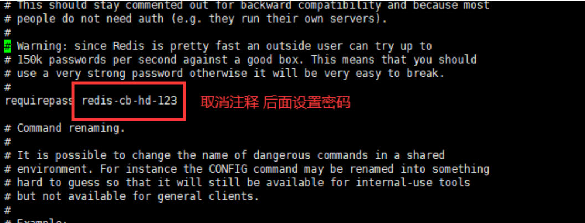
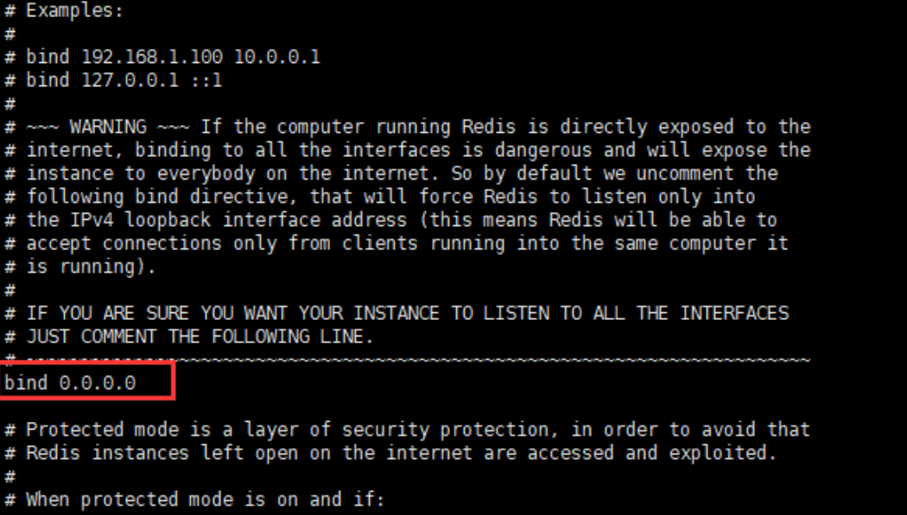
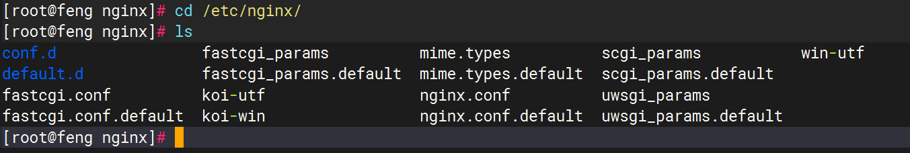
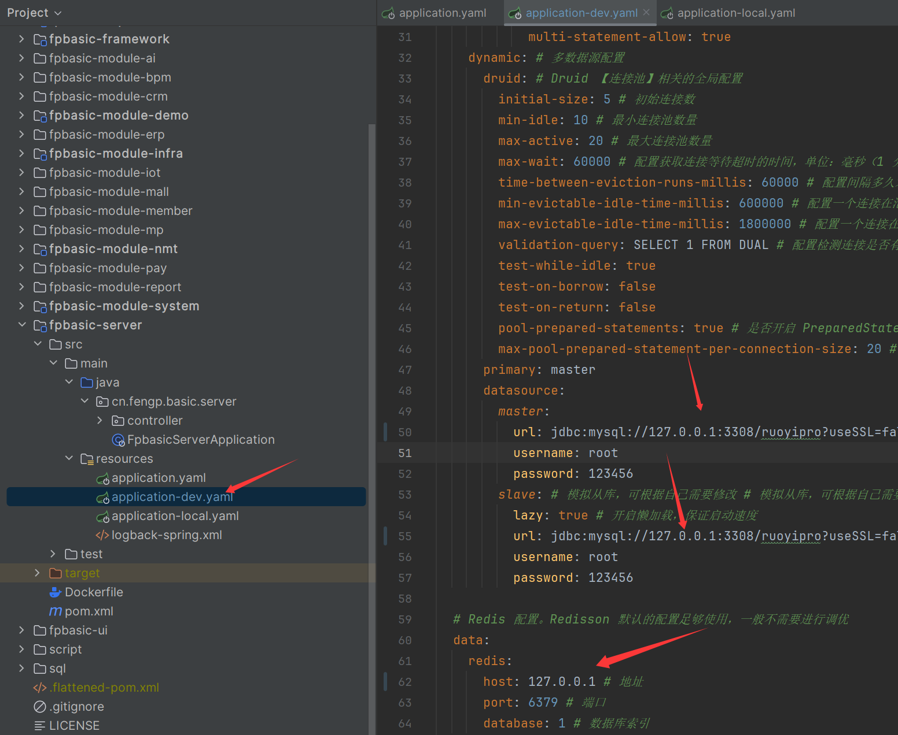
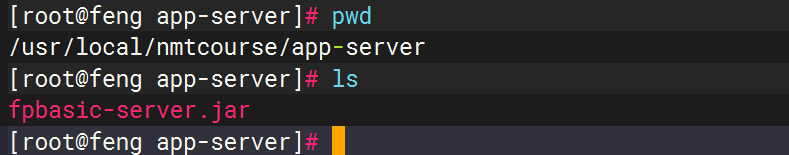
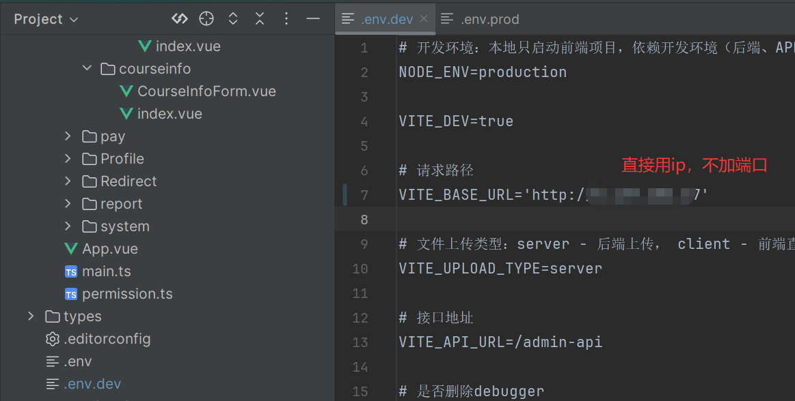
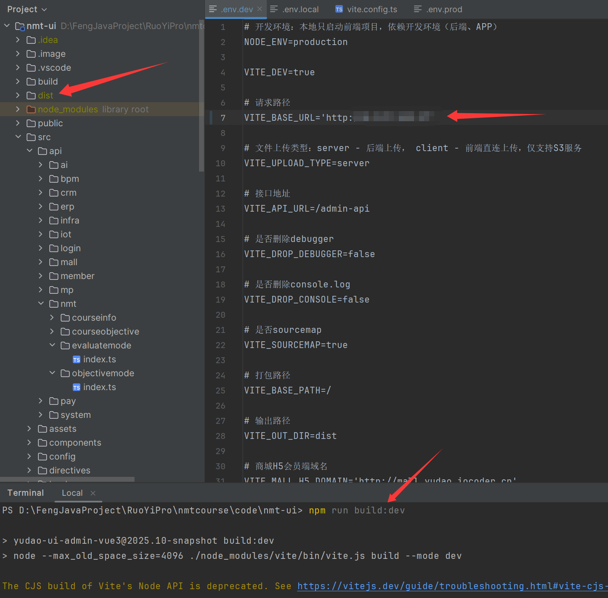
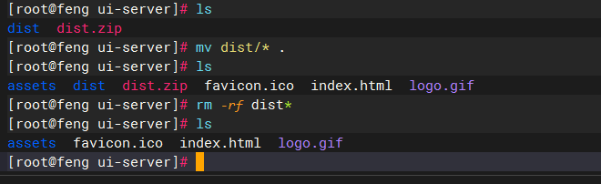
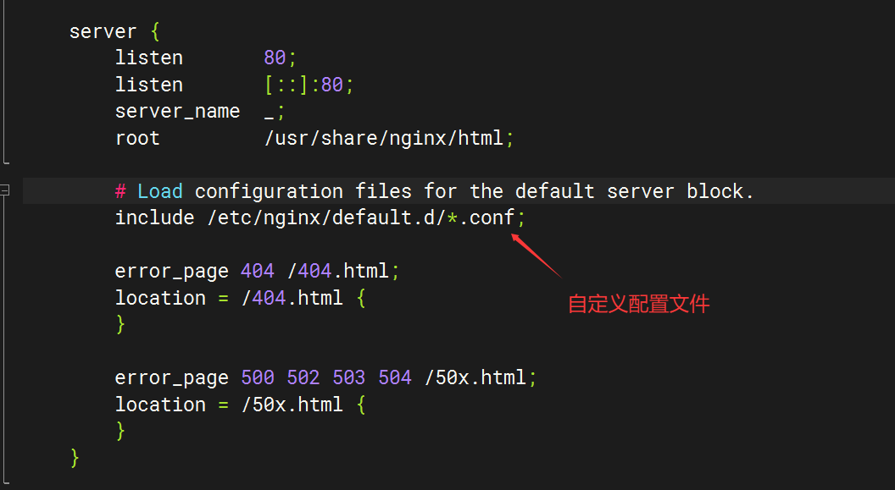
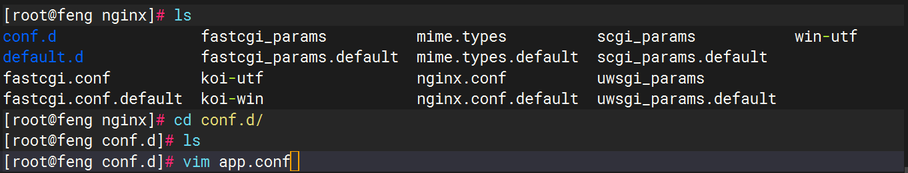

# 工程认证课程达成度计算与分析


# 1 课程目标达成度计算方式

## 方式1  分值型矩阵

### 计算公式

**CO_j = Σ( AvgScore(j,i) ÷ DesignScore(j,i) × Wi )**

### 课程考核方式

| 考核方式 | 权重 |
| -------- | ---- |
| 平时考核 | 20%  |
| 实验     | 20%  |
| 期末考试 | 60%  |

**说明**

所有考核方式的权重之和为1


### 考核评价矩阵

平时考核满分 100

实验满分 100

期末满分 100

| 课程目标 | 平时 | 实验 | 期末 |
| -------- | ---- | ---- | ---- |
| CO1      | 10   | 40   | 20   |
| CO2      | 10   | 20   | 20   |
| CO3      | 80   | 40   | 60   |

**说明**

每种考核方式总分可以不设置成100 ，计算方式相同。

工程认证 **从来没有要求：**

> ❌ 所有考核方式必须 100 分制

工程认证关心的是：

> **相对贡献 + 可追溯 + 可复算**

**如果设置成实验和期末考核 满分80，写进认证材料的一段说明**

> 本课程各考核方式采用不同设计满分，其中平时考核满分为 100 分，实验考核满分为 80 分，期末考试满分为 80 分。
>  在课程目标达成度计算中，以各考核方式的设计分值作为归一化基准，结合考核方式权重进行加权计算，确保不同考核方式在统一标准下进行课程目标达成度评价。


**CO1达成度计算**

学生：王一

| 考核方式 | 设计分值 | 实际平均分 | 权重 |
| -------- | -------- | ---------- | ---- |
| 平时     | 10       | 8          | 0.2  |
| 实验     | 40       | 34         | 0.2  |
| 期末     | 20       | 16         | 0.6  |

CO1达成度 =  8/10 * 0.2   + 34/40 * 0.2   + 16 / 20 * 0.6


## 方式2  比例型矩阵

### 简要

**比例型矩阵：**

❗ **必须做归一化**

但归一化方式 **只有两种合法选择（二选一）**：

**① 行归一（推荐）**
 **② 列归一（较少用）**

❌ **绝对不允许：行和 ≠ 1 且 列和 ≠ 1**


### 方案1 列归一比例型矩阵（较少使用）

#### 要求

> **对每一种考核方式 i：**

```
Σ Rj,i = 1
```

- 列和 = 1

- 行和 ❌ 没有要求

  

#### 计算公式

课程目标 CO_j 的达成度计算如下：

1. 计算分子  
   分子 = Σ（考核方式权重 Wi × 支撑比例 Rj,i × 考核方式达成度 Ai）
2. 计算分母  
   分母 = Σ（考核方式权重 Wi × 支撑比例 Rj,i）
3. 课程目标达成度  
   CO_j = 分子 ÷ 分母

**CO_j = Σ (Wi × Rj,i × Ai) ÷ Σ (Wi × Rj,i)**


#### 课程考核达成度评价

|           | 考核方式以及成绩占比（%） |      |          |          |
| --------- | :------------------------ | ---- | -------- | -------- |
|           | 平时考核                  | 实验 | 期末考试 | **合计** |
| 课程目标1 | 10                        | 40   | 20       | **70**   |
| 课程目标2 | 10                        | 20   | 20       | **50**   |
| 课程目标3 | 80                        | 20   | 20       | **120**  |
| 课程目标4 | 0                         | 20   | 40       | **60**   |
| **合计**  | 100                       | 100  | 100      |          |


#### 考核计划设置

| 课程目标      | 考核方式 | 权重占比 | 考核内容  |
| ------------- | -------- | -------- | --------- |
| **课程目标1** | 平时考核 | 1/7      | 平时题目1 |
|               | 实验     | 4/7      | 实验题目1 |
|               | 期末考试 | 2/7      | 期末题目1 |
| **课程目标2** | 平时考核 | 1/5      | 平时题目2 |
|               | 实验     | 2/5      | 实验题目2 |
|               | 期末考试 | 2/5      | 期末题目2 |
| **课程目标3** | 平时考核 | 8/12     | 平时题目3 |
|               | 实验     | 2/12     | 实验题目3 |
|               | 期末考试 | 2/12     | 期末题目3 |
| **课程目标4** | 实验     | 2/6      | 实验题目4 |
|               | 期末考试 | 4/6      | 期末题目4 |

**说明**

1、每个课程目标对应不同的考核权重值为 课程达成度评价矩阵中  **单个考核方式分数/课程目标合计分数** （行内归一化）

​			例如 课程目标1 - 平时考核- 权重占比： **10/70**

2、每个课程目标对应的所有权重占比之和为1

​		可以拆分每个课程目标对应考核方式的考核内容（例如：课程目标1-实验 ： 把考核内容拆成两个题目，每个2/7，综合还是 4/7）


#### 课程目标达成度计算

学生：王一 ，考核得分如下：

| 课程目标1          | 得分 |
| ------------------ | ---- |
| 平时考核（总分10） | 8    |
| 实验（总分20）     | 15   |
| 期末考试（总分40） | 34   |

**课程目标1达成度计算过程**

**分子** =  0.2（平时考核权重）* 1/7（平时考核支撑比例）* 8/10（平时考核实际达成度）

​			+    0.2 * 4/7  * 15/20    +   0.6  *   2/7  *  34/40  =  **0.2542**

**分母** =  0.2（平时考核权重）* 1/7（平时考核支撑比例）

​			+    0.2 * 4/7     +   0.6  *   2/7  = **0.3142**

**课程目标1达成度** = 分子/分母 = 0.2542/0.3142 = **0.8090**


### 方案2  行归一比例型矩阵

#### 要求

> **对每一个课程目标 CO_j：**

```
Σ Rj,i = 1
```

- 行和 = 1
- 列和 ❌ 没有要求


#### 考核评价矩阵

| 课程目标 \ 考核方式 | 平时 | 实验 | 期末 | 行和    |
| ------------------- | ---- | ---- | ---- | ------- |
| CO1                 | 0.2  | 0.5  | 0.3  | **1.0** |
| CO2                 | 0.3  | 0.2  | 0.5  | **1.0** |
| CO3                 | 0.1  | 0.3  | 0.6  | **1.0** |

 

#### 计算公式

```
CO_j = Σ (Wi × Rj,i × Ai)
```

> ⚠️ **此时不需要再除以 Σ(Wi × Rj,i)**
>  因为 Rj,i 已经行归一


# Docker 部署

## 1 环境准备

### 1.1 安装Docker

**博客地址：**  https://www.cnblogs.com/fengpeng123/p/17931608.html

### 1.2 安装MySQL 容器

#### 1.2.1 新建目录

```bash
mkdir -p /usr/local/dockerdata/mysql8/data \
/usr/local/dockerdata/mysql8/conf \
/usr/local/dockerdata/mysql8/log 
```

#### 1.2.2 初始空数据创建

**密码改成自己的**

```bash
sudo docker run -d --restart=always --name mysql8 -p 3308:3306 -e TZ=Asia/Shanghai -e MYSQL_ROOT_PASSWORD=xxxx mysql:8.0 --character-set-server=utf8mb4
```

#### 1.2.3 拷贝原文件到挂载

**查看mysql logs日志，启动之后再 挂载**

```bash
docker cp mysql8:/var/lib/mysql/. /usr/local/dockerdata/mysql8/data
docker cp mysql8:/etc/mysql/conf.d/.  /usr/local/dockerdata/mysql8/conf
docker cp mysql8:/var/log/.  /usr/local/dockerdata/mysql8/log
```

#### 1.2.4 启动数据库

**密码改成自己的**

```bash
sudo docker run -d --restart=always --name mysql8 -v /usr/local/dockerdata/mysql8/data:/var/lib/mysql -v /usr/local/dockerdata/mysql8/conf:/etc/mysql/conf.d -v /usr/local/dockerdata/mysql8/log:/var/log/mysql -p 3308:3306 -e TZ=Asia/Shanghai -e MYSQL_ROOT_PASSWORD=xxxx mysql:8.0 --character-set-server=utf8mb4
```

#### 1.2.5 设置身份验证

**密码改成自己的**

```bash
docker exec -it mysql8 bash
mysql -uroot -p
执行
ALTER USER 'root'@'%' IDENTIFIED WITH mysql_native_password BY 'xxxx';
FLUSH PRIVILEGES;
```

### 1.3 安装Redis容器

#### 1.3.1 创建本机映射文件路径

```bash
mkdir -p /usr/local/dockerdata/redis && cd /usr/local/dockerdata/redis && mkdir -p {conf,data}
```

#### 1.3.2 下载redis.conf文件

```bash
cd /usr/local/dockerdata/redis/conf
wget http://download.redis.io/releases/redis-7.0.14.tar.gz
tar -zxvf redis-7.0.14.tar.gz
cp redis-7.0.14/redis.conf /usr/local/dockerdata/redis/conf/
```

#### 1.3.3 文件授权

```bash
chmod 777 redis.conf
```

#### 1.3.4 修改配置文件

```bash
vim redis.conf
```

**设置允许外部网络访问 将protected-mode 设置为no**


**设置访问密码:  你的密码**

搜索 /requirepass




**设置可访问ip  0.0.0.0表示所有ip都可以访问**



#### 1.3.5 启动容器

**redis-server /etc/redis/redis.conf 代表用这个配置文件内容启动容器**

```bash
docker run --restart=always \
-p 6379:6379 \
--name redis \
-v /usr/local/dockerdata/redis/conf/redis.conf:/etc/redis/redis.conf \
-v /usr/local/dockerdata/redis/data:/data \
-d redis:7.0 redis-server /etc/redis/redis.conf \
--appendonly yes
```

#### 1.3.6 容器内验证

```bash
redis-cli
auth 密码
ping
```


### 1.4 安装Nginx（非容器）

#### 1.4.1 yum安装

**使用 yum 进行 Nginx 安装时，Nginx 配置文件在 `/etc/nginx` 目录下**

```bash
# -y：然后在安装过程中，所有：
# Is this ok [y/N]:
# 自动输入 y
sudo yum -y install nginx
```



##### nginx命令

```bash
#查看状态
sudo systemctl status nginx
或者
ps -ef | grep nginx

#启动 Nginx
sudo systemctl start nginx
#停止 Nginx
sudo systemctl stop nginx
#平滑加载新配置(修改nginx.conf)
sudo systemctl reload nginx
#完全重启 nginx
sudo systemctl restart nginx
#开机自启
sudo systemctl enable nginx
#取消开机自启
sudo systemctl disable nginx
# 访问日志
tail -f /var/log/nginx/access.log
# 错误日志
tail -f /var/log/nginx/error.log

```

##### 测试配置

```bash
sudo nginx -t
输出
nginx: the configuration file /etc/nginx/nginx.conf syntax is ok
nginx: configuration file /etc/nginx/nginx.conf test is successful
```

**必须先 test 配置再 reload/restart**，防止 Nginx 因配置错误挂掉

##### 访问服务器ip查看

ip:     http://xxx.xx.xx.xx/ 端口默认80，可以在nginx.conf中修改。

如果看到welcom to nginx！代表成功了


#### 1.4.2 源码安装

##### 安装依赖包

```cmd
//一键安装上面四个依赖
yum -y install gcc zlib zlib-devel pcre-devel openssl openssl-devel
```

##### 下载并解压安装包

```cmd
//创建一个文件夹
cd /usr/local
mkdir nginx
cd nginx
//下载tar包
wget http://nginx.org/download/nginx-1.13.7.tar.gz
tar -zxvf nginx-1.13.7.tar.gz
```

##### 安装nginx

```cmd
//进入nginx目录
cd /usr/local/nginx
//进入目录
cd nginx-1.13.7
//执行命令 考虑到后续安装ssl证书 添加两个模块(选功能、查环境)
./configure --with-http_stub_status_module --with-http_ssl_module
//执行make命令(编译程序)
make
//执行make install命令(安装到系统)
make install
```


##### 启动nginx服务

```cmd
/usr/local/nginx/sbin/nginx
//查看是否启动成功
ps -ef | grep nginx
```

##### 配置nginx.conf

```cmd
# 打开配置文件
vim /usr/local/nginx/conf/nginx.conf
```

##### 重启nginx

```cmd
/usr/local/nginx/sbin/nginx -s reload
```

##### 开发端口

若想使用外部主机访问nginx，需要关闭服务器防火墙或开放nginx服务端口，端口为上一步nginx.conf的配置端口

centOS7关闭防火墙命令： systemctl stop firewalld.service

关闭防火墙会导致服务器有一定风险，所以建议是单独开放服务端口 ：

开放80端口：

firewall-cmd --zone=public --add-port=80/tcp --permanent

查询端口号80 是否开启：

firewall-cmd --query-port=80/tcp

重启防火墙：

firewall-cmd --reload

随后访问该ip:端口 即可看到nginx界面。

##### 访问服务器ip查看

ip:     http://xxx.xx.xx.xx/ 端口默认80，可以在nginx.conf中修改。

如果看到welcom to nginx！代表成功了

##### 安装完成一般常用命令

进入安装目录中，

命令： cd /usr/local/nginx/sbin

**文件显示绿色，代表可以执行文件**

启动，关闭，重启，命令：

./nginx 启动

./nginx -s stop 关闭

./nginx -s reload 重启


## 2 部署后端

### 2.1 修改配置

后端 dev 开发环境对应的是 application-dev.yaml配置文件，主要是修改 MySQL 和 Redis 为你的地址




### 2.2 打成jar包

在项目的根目录下，执行 mvn clean package -DskipTests 命令，编译后端项目，构建出它的 Jar 包。

### 2.3 上传jar包



### 2.4 构建镜像

① 在 `/usr/local/nmtcourse/app-server` 目录下，新建 Dockerfile 文件，用于制作后端项目的 Docker 镜像。编写内容如下：

```bash
#新建 Dockerfile
vim app_dockerfile
```

```bash
## AdoptOpenJDK 停止发布 OpenJDK 二进制，而 Eclipse Temurin 是它的延伸，提供更好的稳定性
FROM m.daocloud.io/docker.io/eclipse-temurin:17-jre

## 创建目录，并使用它作为工作目录
RUN mkdir -p /app-server
WORKDIR /app-server
## 将后端项目的 Jar 文件，复制到镜像中(不复制，使用挂载方式)
#COPY fpbasic-server.jar app.jar

## 设置 TZ 时区
## 设置 JAVA_OPTS 环境变量，可通过 docker run -e "JAVA_OPTS=" 进行覆盖
ENV TZ=Asia/Shanghai JAVA_OPTS="-Xms512m -Xmx512m"

## 暴露后端项目的 48080 端口
EXPOSE 48080

## 启动后端项目
ENTRYPOINT java ${JAVA_OPTS} -Djava.security.egd=file:/dev/./urandom -jar app.jar
```

② 执行如下命令，构建名字为 `yudao-server` 的 Docker 镜像。

```bash
cd /usr/local/nmtcourse/app-server
# -t:指定镜像名和标签 -f:指定dockerfile文件  . :表示在当前目录下查找对应的dockerfile来构建镜像
docker build -t app-server -f app_dockerfile .
#创建日志目录
mkdir logs
```

③ 在 `/usr/local/nmtcourse/app-server` 目录下，新建 Shell 脚本 `deploy.sh`，使用 Docker 启动后端项目。编写内容如下：

```bash
#!/bin/bash
set -e

echo "部署 app-server 容器..."

# 判断容器是否存在
if docker ps -a --format '{{.Names}}' | grep -q '^app-server$'; then
    # 容器存在，停止后启动
    docker stop app-server
    echo "已停止 app-server 容器"
    docker start app-server
else
    # 容器不存在，直接创建
    echo "app-server 容器不存在，正在创建..."
    mkdir -p /usr/local/nmtcourse/app-server/logs   # 确保日志目录存在
    docker run -d \
        --name app-server \
        -p 48080:48080 \
        -e "SPRING_PROFILES_ACTIVE=dev" \
        -v /usr/local/nmtcourse/app-server/fpbasic-server.jar:/app-server/app.jar \
        -v /usr/local/nmtcourse/app-server/logs:/root/logs \
        app-server
fi

echo "app-server 容器已启动，应用可能需要约 60 秒完成启动"
```

- **挂载jar,以后部署，必须先stop 容器，然后上传jar包**
- 应用日志文件，挂载到服务器的的 `/usr/local/nmtcourse/app-server` 目录下
- 通过 `SPRING_PROFILES_ACTIVE` 设置为 `dev` 开发环境

### 2.5 启动后端

**首次启动：**

执行 `sh deploy.sh` 命令，使用 Docker 启动后端项目。

**后续更新部署：**

```bash
docker stop app-server
上传jar包
sh deploy.sh
```


### 2.6 查看日志

```bash
docker logs --tail 100 -f app-server
```


## 3 部署前端

#### 3.1 修改配置

**不用加端口，默认是80**



#### 3.2 编译前端

```bash
npm run build:dev
```




#### 3.3 上传dist

新建/usr/local/nmtcourse/ui-server目录




## 4 配置Nginx转发

**新建自定义配置文件app.conf**

```bash
cat nginx.conf
```





**app.conf**

```bash
server {
    listen       80;
    server_name  xxx.xx.xx.xx; ## 重要！！！修改成你的外网 IP/域名

    location / { ## 前端项目
        root   /usr/local/nmtcourse/ui-server;
        index  index.html index.htm;
        try_files $uri $uri/ /index.html;
    }

    location /admin-api/ { ## 后端项目 - 管理后台
        proxy_pass http://xxx.xx.xx.xx:48080/admin-api/;##重要！！！proxy_pass 需要设置为后端项目所在服务器的IP
        proxy_set_header Host $http_host;
        proxy_set_header X-Real-IP $remote_addr;
        proxy_set_header REMOTE-HOST $remote_addr;
        proxy_set_header X-Forwarded-For $proxy_add_x_forwarded_for;
    }

    location /app-api/ { ## 后端项目 - 用户 App
        proxy_pass http://xxx.xx.xx.xx:48080/app-api/;##重要！！！proxy_pass 需要设置为后端项目所在服务器的IP
        proxy_set_header Host $http_host;
        proxy_set_header X-Real-IP $remote_addr;
        proxy_set_header REMOTE-HOST $remote_addr;
        proxy_set_header X-Forwarded-For $proxy_add_x_forwarded_for;
    }

}
```

**注意**

 **location 与 proxy_pass 路径关系**

- **`location /admin-api/` 匹配浏览器请求 `/admin-api/...`**

  1.`proxy_pass http://127.0.0.1:48080;` →        **结尾不加 /，保留 `/admin-api/`**

  - 这样 `/admin-api/getlogin` → 转发到 `127.0.0.1:48080/admin-api/getlogin`

  2.如果写成 `proxy_pass http://127.0.0.1:48080/;`     **结尾加了/，去除前缀，替换成/**

  - Nginx 会把 `/admin-api/` 替换成 `/` → 转发到 `127.0.0.1:48080/getlogin`

✅ 所以 **去掉末尾斜杠** 或直接写 `proxy_pass http://127.0.0.1:48080;` 最安全

```bash
#如果nginx和后端容器在同一台服务器：
	# proxy_pass可以写成127.0.0.1:48080，表示本机回环地址 → 直接走本机网络，不经过外网。
	# proxy_pass可以写成外网 IP → 本机访问也能通，但可能被防火墙阻挡，速度慢(必须开放安全组端口)
location /admin-api/ { ## 后端项目 - 管理后台
        proxy_pass http://127.0.0.1:48080;#转发后地址：http://127.0.0.1:48080/admin-api/
        proxy_pass http://127.0.0.1:48080/;#转发后地址：http://127.0.0.1:48080/
        
#如果nginx和后端容器不管是否同一台服务器，都必须开放安全组端口：        
location /admin-api/ { ## 后端项目 - 管理后台
        proxy_pass http://8.xx.xx.7:48080/admin-api/;#转发后地址：http://8.xx.xx.7:48080/admin-api/
```

**如果nginx和后端容器在同一台服务器，推荐用127.0.0.1，不存在跨域，因为本机直连，稳定，安全，不被防火墙/安全组限制。**

**同源策略**

协议 + 域名(IP) + 端口

```text
同源是浏览器判断的，不是后端、不是 Nginx
浏览器
  |
  |  GET http://8.xx.xx.17/admin-api/getlogin
  |
Nginx (80)
浏览器判断：origin = http://8.xx.xx.17:80,只有一个端口：80 → 同源

浏览器看不到的世界（服务器内部）
Nginx
  |
  |  proxy_pass http://127.0.0.1:48080/admin-api/getlogin
  |
后端 Spring Boot

这一段是 服务器内部通信：
	浏览器 完全不知道
	不参与同源判断
	端口 48080 对浏览器是“隐形的”
	
重点对比
	1.直接访问后端（会跨域）
	浏览器 → http://8.xx.xx.17:48080/admin-api/...
	浏览器看到：
		前端: http://8.xx.xx.17:80
		后端: http://8.xx.xx.17:48080
	端口不同 → 跨域
	
	2.浏览器 → http://8.xx.xx.17/admin-api/...
           |
           └── Nginx → 127.0.0.1:48080
      浏览器看到：始终是 http://8.xx.xx.17:80  同源
总结：
CORS 判断发生在「浏览器发请求那一刻」，
proxy_pass 是服务器内部的事，浏览器根本不知道。
所以用了nginx，后端代码不需要处理跨域。
```


## 5 访问测试

ip:     http://xxx.xx.xx.xx/ 端口默认80