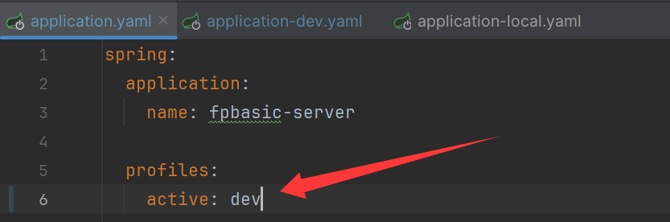
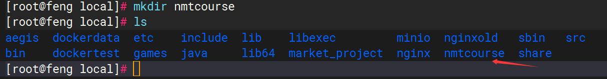

# 工程认证课程达成度计算与分析


# 1 课程目标达成度计算方式

## 方式1  分值型矩阵

### 计算公式

**CO_j = Σ( AvgScore(j,i) ÷ DesignScore(j,i) × Wi )**

### 课程考核方式

| 考核方式 | 权重 |
| -------- | ---- |
| 平时考核 | 20%  |
| 实验     | 20%  |
| 期末考试 | 60%  |

**说明**

所有考核方式的权重之和为1


### 考核评价矩阵

平时考核满分 100

实验满分 100

期末满分 100

| 课程目标 | 平时 | 实验 | 期末 |
| -------- | ---- | ---- | ---- |
| CO1      | 10   | 40   | 20   |
| CO2      | 10   | 20   | 20   |
| CO3      | 80   | 40   | 60   |

**说明**

每种考核方式总分可以不设置成100 ，计算方式相同。

工程认证 **从来没有要求：**

> ❌ 所有考核方式必须 100 分制

工程认证关心的是：

> **相对贡献 + 可追溯 + 可复算**

**如果设置成实验和期末考核 满分80，写进认证材料的一段说明**

> 本课程各考核方式采用不同设计满分，其中平时考核满分为 100 分，实验考核满分为 80 分，期末考试满分为 80 分。
>  在课程目标达成度计算中，以各考核方式的设计分值作为归一化基准，结合考核方式权重进行加权计算，确保不同考核方式在统一标准下进行课程目标达成度评价。


**CO1达成度计算**

学生：王一

| 考核方式 | 设计分值 | 实际平均分 | 权重 |
| -------- | -------- | ---------- | ---- |
| 平时     | 10       | 8          | 0.2  |
| 实验     | 40       | 34         | 0.2  |
| 期末     | 20       | 16         | 0.6  |

CO1达成度 =  8/10 * 0.2   + 34/40 * 0.2   + 16 / 20 * 0.6


## 方式2  比例型矩阵

### 简要

**比例型矩阵：**

❗ **必须做归一化**

但归一化方式 **只有两种合法选择（二选一）**：

**① 行归一（推荐）**
 **② 列归一（较少用）**

❌ **绝对不允许：行和 ≠ 1 且 列和 ≠ 1**


### 方案1 列归一比例型矩阵（较少使用）

#### 要求

> **对每一种考核方式 i：**

```
Σ Rj,i = 1
```

- 列和 = 1

- 行和 ❌ 没有要求

  

#### 计算公式

课程目标 CO_j 的达成度计算如下：

1. 计算分子  
   分子 = Σ（考核方式权重 Wi × 支撑比例 Rj,i × 考核方式达成度 Ai）
2. 计算分母  
   分母 = Σ（考核方式权重 Wi × 支撑比例 Rj,i）
3. 课程目标达成度  
   CO_j = 分子 ÷ 分母

**CO_j = Σ (Wi × Rj,i × Ai) ÷ Σ (Wi × Rj,i)**


#### 课程考核达成度评价

|           | 考核方式以及成绩占比（%） |      |          |          |
| --------- | :------------------------ | ---- | -------- | -------- |
|           | 平时考核                  | 实验 | 期末考试 | **合计** |
| 课程目标1 | 10                        | 40   | 20       | **70**   |
| 课程目标2 | 10                        | 20   | 20       | **50**   |
| 课程目标3 | 80                        | 20   | 20       | **120**  |
| 课程目标4 | 0                         | 20   | 40       | **60**   |
| **合计**  | 100                       | 100  | 100      |          |


#### 考核计划设置

| 课程目标      | 考核方式 | 权重占比 | 考核内容  |
| ------------- | -------- | -------- | --------- |
| **课程目标1** | 平时考核 | 1/7      | 平时题目1 |
|               | 实验     | 4/7      | 实验题目1 |
|               | 期末考试 | 2/7      | 期末题目1 |
| **课程目标2** | 平时考核 | 1/5      | 平时题目2 |
|               | 实验     | 2/5      | 实验题目2 |
|               | 期末考试 | 2/5      | 期末题目2 |
| **课程目标3** | 平时考核 | 8/12     | 平时题目3 |
|               | 实验     | 2/12     | 实验题目3 |
|               | 期末考试 | 2/12     | 期末题目3 |
| **课程目标4** | 实验     | 2/6      | 实验题目4 |
|               | 期末考试 | 4/6      | 期末题目4 |

**说明**

1、每个课程目标对应不同的考核权重值为 课程达成度评价矩阵中  **单个考核方式分数/课程目标合计分数** （行内归一化）

​			例如 课程目标1 - 平时考核- 权重占比： **10/70**

2、每个课程目标对应的所有权重占比之和为1

​		可以拆分每个课程目标对应考核方式的考核内容（例如：课程目标1-实验 ： 把考核内容拆成两个题目，每个2/7，综合还是 4/7）


#### 课程目标达成度计算

学生：王一 ，考核得分如下：

| 课程目标1          | 得分 |
| ------------------ | ---- |
| 平时考核（总分10） | 8    |
| 实验（总分20）     | 15   |
| 期末考试（总分40） | 34   |

**课程目标1达成度计算过程**

**分子** =  0.2（平时考核权重）* 1/7（平时考核支撑比例）* 8/10（平时考核实际达成度）

​			+    0.2 * 4/7  * 15/20    +   0.6  *   2/7  *  34/40  =  **0.2542**

**分母** =  0.2（平时考核权重）* 1/7（平时考核支撑比例）

​			+    0.2 * 4/7     +   0.6  *   2/7  = **0.3142**

**课程目标1达成度** = 分子/分母 = 0.2542/0.3142 = **0.8090**


### 方案2  行归一比例型矩阵

#### 要求

> **对每一个课程目标 CO_j：**

```
Σ Rj,i = 1
```

- 行和 = 1
- 列和 ❌ 没有要求


#### 考核评价矩阵

| 课程目标 \ 考核方式 | 平时 | 实验 | 期末 | 行和    |
| ------------------- | ---- | ---- | ---- | ------- |
| CO1                 | 0.2  | 0.5  | 0.3  | **1.0** |
| CO2                 | 0.3  | 0.2  | 0.5  | **1.0** |
| CO3                 | 0.1  | 0.3  | 0.6  | **1.0** |

 

#### 计算公式

```
CO_j = Σ (Wi × Rj,i × Ai)
```

> ⚠️ **此时不需要再除以 Σ(Wi × Rj,i)**
>  因为 Rj,i 已经行归一


# Docker 部署

## 1 环境准备

### 1.1 安装Docker

### 1.2 安装MySQL 容器

### 1.3 安装Redis容器

### 1.4 安装Nginx（非容器）

#### 1.4.1 安装依赖包

```cmd
//一键安装上面四个依赖
yum -y install gcc zlib zlib-devel pcre-devel openssl openssl-devel
```

#### 1.4.2 下载并解压安装包

```cmd
//创建一个文件夹
cd /usr/local
mkdir nginx
cd nginx
//下载tar包
wget http://nginx.org/download/nginx-1.13.7.tar.gz
tar -zxvf nginx-1.13.7.tar.gz
```

#### 1.4.3 安装nginx

```cmd
//进入nginx目录
cd /usr/local/nginx
//进入目录
cd nginx-1.13.7
//执行命令 考虑到后续安装ssl证书 添加两个模块(选功能、查环境)
./configure --with-http_stub_status_module --with-http_ssl_module
//执行make命令(编译程序)
make
//执行make install命令(安装到系统)
make install
```


#### 1.4.4 启动nginx服务

```cmd
/usr/local/nginx/sbin/nginx -c /usr/local/nginx/conf/nginx.conf
//查看是否启动成功
ps -ef | grep nginx
```

#### 1.4.5 配置nginx.conf

```cmd
# 打开配置文件
vi /usr/local/nginx/conf/nginx.conf
```

#### 1.4.6 重启nginx

```cmd
/usr/local/nginx/sbin/nginx -s reload
```

#### 1.4.7 开发端口

若想使用外部主机访问nginx，需要关闭服务器防火墙或开放nginx服务端口，端口为上一步nginx.conf的配置端口

centOS7关闭防火墙命令： systemctl stop firewalld.service

关闭防火墙会导致服务器有一定风险，所以建议是单独开放服务端口 ：

开放80端口：

firewall-cmd --zone=public --add-port=80/tcp --permanent

查询端口号80 是否开启：

firewall-cmd --query-port=80/tcp

重启防火墙：

firewall-cmd --reload

随后访问该ip:端口 即可看到nginx界面。

#### 1.4.8 访问服务器ip查看

ip:     http://xxx.xx.xx.xx/ 端口默认80，可以在nginx.conf中修改。

如果看到welcom to nginx！代表成功了

#### 1.4.9 安装完成一般常用命令

进入安装目录中，

命令： cd /usr/local/nginx/sbin

**文件显示绿色，代表可以执行文件**

启动，关闭，重启，命令：

./nginx 启动

./nginx -s stop 关闭

./nginx -s reload 重启


## 2 部署后端

### 2.1 修改配置

后端 dev 开发环境对应的是 application-dev.yaml配置文件，主要是修改 MySQL 和 Redis 为你的地址




### 2.2 打成jar包

在项目的根目录下，执行 mvn clean package -DskipTests 命令，编译后端项目，构建出它的 Jar 包。

### 2.3 上传jar包



